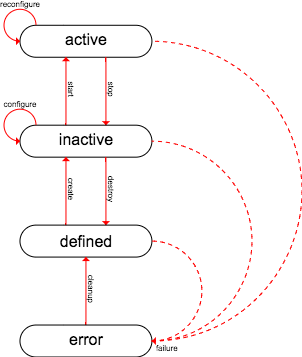

State Definitions
=================

The desired target state of a virtualized network functions is achieved by
applying a list of target state definitions of the various entities which
a virtualized network may be requiring or referring to.

Following types of entities may be defined this way:

| Entity Type                                         | Description                                                        |
|-----------------------------------------------------|--------------------------------------------------------------------|
| [External Network](entities/ExternalNetwork.md)     | Routing networks connecting the VNF services to the external world |
| [External Component](entities/ExternalComponent.md) | External communication partners                                    |
| [VNF](entities/VNF.md)                              | The virtualized network function itself                            |
| [Tenant](entities/Tenant.md)                        | A virtualized data center belonging to the VNF                     |
| [Internal Network](entities/InternalNetwork.md)     | A tenant routing network                                           |
| [Internal Component](entities/InternalComponent.md) | A cluster of compute nodes                                         |
| [Node]((entities/Node.md))                          | A single compute node                                              |

Properties
----------

Each entity definition consists of a set of general properties and entity type specific configuration attributes.

| Property        | Description                                     |
|-----------------|-------------------------------------------------|
| **type**        | entity type                                     |
| **name**        | unique identifier (8-256 characters)            |
| description     | short description (max 2048 characters)         |
| **state**       | defined, inactive, active, error                |
| **version**     | semantic version Vx.y.z                         |

The properties of each state definition allows to uniquely identify the corresponding component.

The state property refers to the desired state of the entity and need to be one of the standardized life cycle states: `error`, `defined`, `inactive` or `active`.

